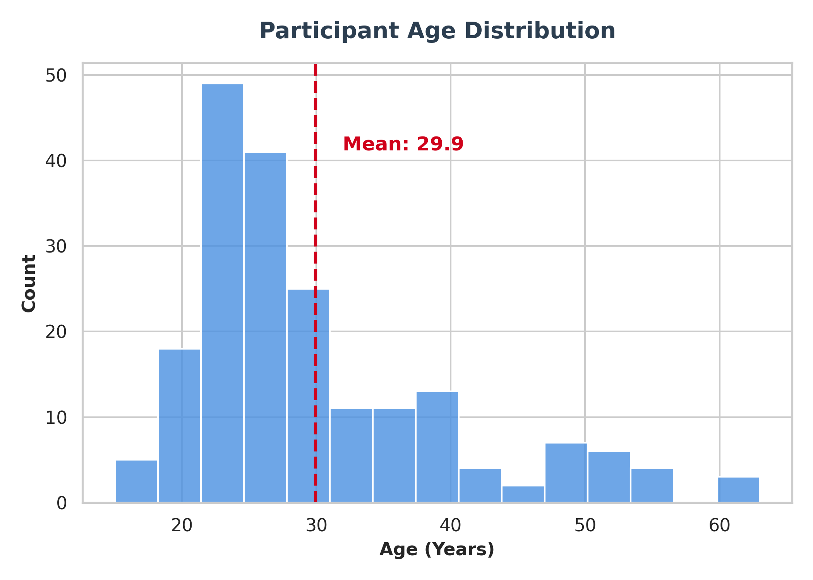
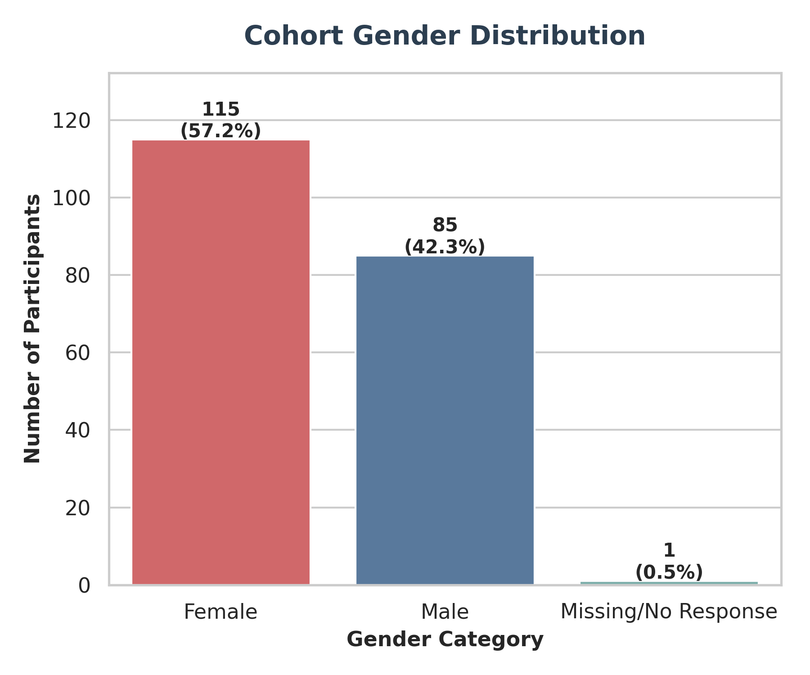
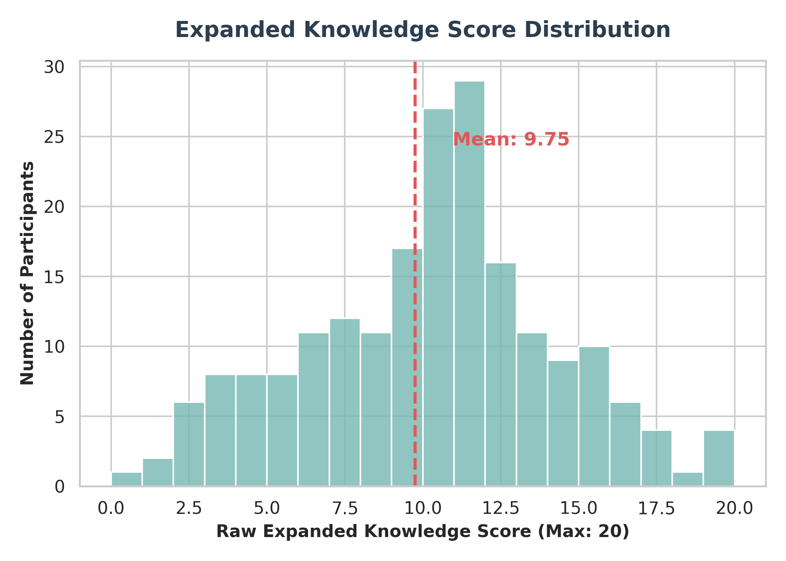
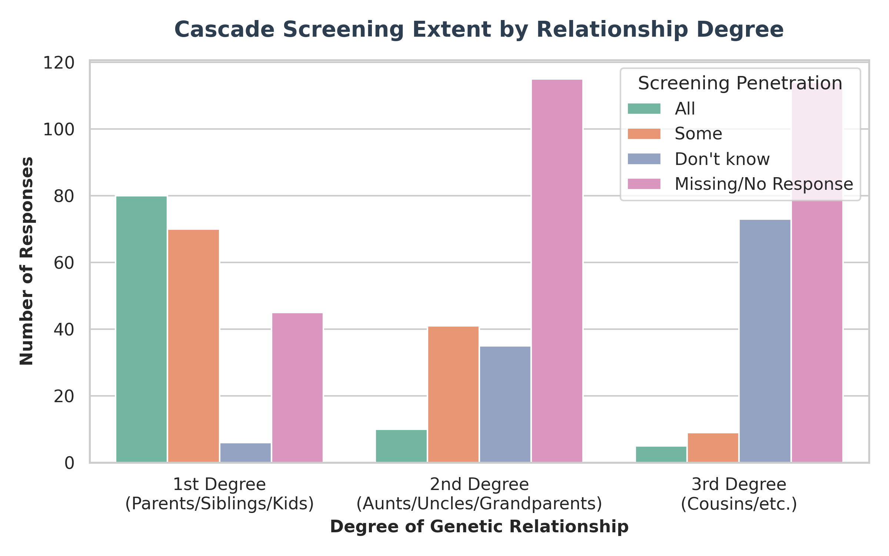

# 1. Abstract

**Background:** Thalassemia is a severe autosomal recessive blood disorder that places a massive burden on global and regional healthcare systems. Due to the genetic nature of the disease, primary prevention through carrier screening, pre-marital counseling, and cascade screening (testing extended family members) remains the most effective strategy to reduce disease incidence. 

**Methods:** A comprehensive cross-sectional survey was conducted among 201 participants to assess their baseline Knowledge, Attitudes, and Practices (KAP). An automated data processing pipeline (R/Python) was utilized for descriptive and inferential statistical analysis. 

**Results:** The descriptive data highlighted substantial gaps in knowledge regarding the curability and genetic transmission of Thalassemia. Inferential tests revealed stark socio-demographic disparities: individuals with higher education demonstrated vastly superior knowledge (p < 0.001) and significantly more progressive attitudes toward partner screening (p < 0.001). Crucially, baseline knowledge was found to be a direct catalyst for action, as high knowledge scores were significantly associated with actual safe screening practices (p = 0.019).

**Conclusion:** The findings unequivocally demonstrate that general awareness campaigns are insufficient. Public health strategies must pivot toward targeted, pre-marital educational counseling that empowers vulnerable populations to translate baseline knowledge into proactive, safe screening practices.

---

# 2. Introduction

Thalassemia syndromes are a heterogeneous group of inherited disorders of hemoglobin synthesis. Because it is an autosomal recessive condition, a child can only inherit Thalassemia Major if both parents are carriers (Thalassemia Minor/Trait). Thus, the birth of affected children is entirely preventable if at-risk couples are identified before marriage or conception.

Despite clear WHO guidelines advocating for pre-marital carrier screening and family cascade screening, uptake remains suboptimal. This research quantifies the baseline KAP of a localized cohort, utilizing rigorous computational data pipelines to identify the demographic bottlenecks hindering the adoption of safe screening practices.

---

# 3. Methodology

A cross-sectional survey was administered to a cohort of 201 participants, collecting data on demographics, general knowledge, partner disclosure, and family cascade screening. 
The data pipeline (Python/Scipy) generated:
* **Descriptive Statistics:** Frequencies and percentages for all survey items.
* **Scoring Metrics:** Expanded Knowledge Score (20 pts), Attitude Scores, and weighted Practice Scores.
* **Inferential Statistics:** Welch’s Independent T-Tests (continuous scores) and Pearson’s Chi-Square Tests (binarized outcomes based on median split), evaluated at a significance threshold of α = 0.05.

---

# 4. Results

## 4.1 Descriptive Analysis: Demographic Profile

The cohort exhibited diverse representation across multiple demographic vectors. Below is a snapshot of key demographic characteristics.

| Characteristic | Category | N (%) |
| :--- | :--- | :--- |
| Age_Group | 25-34 | 77 (38.3%) |
|  | 18-24 | 71 (35.3%) |
|  | 35-44 | 28 (13.9%) |
|  | 45-54 | 15 (7.5%) |
|  | 55+ | 7 (3.5%) |
|  | Missing/No Response | 3 (1.5%) |
| Gender: | Female | 115 (57.2%) |
|  | Male | 85 (42.3%) |
|  | Missing/No Response | 1 (0.5%) |
| Education Level: | Up to A/L | 83 (41.3%) |
|  | Undergraduate | 43 (21.4%) |
|  | Up to O/L | 37 (18.4%) |
|  | Graduate | 36 (17.9%) |
|  | Missing/No Response | 2 (1.0%) |
| Marital Status | Single | 131 (65.2%) |
|  | Married | 70 (34.8%) |

## 4.2 Descriptive Analysis: Baseline Knowledge
A significant portion of the cohort harbored misconceptions about the disease's curability and transmission risks. For example, many were unaware that bone marrow transplants could cure the condition or that carrier couples face a 25% chance of having an affected child.

**Selected Knowledge Responses:**
| Characteristic | Category | N (%) |
| :--- | :--- | :--- |
| Can thalassemia major be cured? | Cannot be cured | 96 (47.8%) |
|  | Don’t know | 67 (33.3%) |
|  | Very difficult (e.g., bone marrow transplant) | 30 (14.9%) |
|  | Can be cured with common treatments | 8 (4.0%) |
| Is a thalassemia carrier usually sick or healthy? | Healthy | 166 (82.6%) |
|  | Not healthy | 20 (10.0%) |
|  | Don’t know | 14 (7.0%) |
|  | Missing/No Response | 1 (0.5%) |
| How many thalassemia births occur in Sri Lanka per year? | Don’t know | 190 (94.5%) |
|  | 40–100 | 8 (4.0%) |
|  | Much less than this (<40) | 2 (1.0%) |
|  | More than this (>100) | 1 (0.5%) |

## 4.3 Descriptive Analysis: Family Cascade Screening Practices
The data indicates that while screening among first-degree relatives occurs with some frequency, the screening rate drops precipitously for second and third-degree relatives.

## 4.4 Inferential Statistical Findings (T-Tests)
Welch's T-tests revealed numerous statistically significant mean differences between demographic groups across the continuous scoring metrics.

| Independent Variable | Outcome Score | p-value | T-Statistic | df |
| :--- | :--- | :--- | :--- | :--- |
| B_Gender | Cascade_Practice_Score | **2.9306e-02** | 2.20 | 196.7 |
| B_Marital | Cascade_Practice_Score | **1.3650e-02** | 2.49 | 170.5 |
| B_Age | Partner_Attitude | **3.8082e-02** | 2.11 | 89.5 |
| B_Education | Expanded_Knowledge_Score | **1.6747e-12** | 7.60 | 176.1 |
| B_Education | Partner_Attitude | **2.3663e-04** | 3.75 | 186.2 |
| B_Education | Cascade_Practice_Score | **3.7520e-02** | 2.10 | 136.8 |
| B_Partner_Practice | Expanded_Knowledge_Score | **9.9938e-03** | 2.69 | 45.2 |
| B_Partner_Practice | Partner_Attitude | **2.6318e-02** | 2.30 | 44.7 |
| Cat_Cascade_Prac | Cascade_Attitude | **7.3342e-07** | -5.16 | 154.9 |

**Key Observations:**
* **The Impact of Education:** Participants with a Degree or above had a vastly superior Expanded Knowledge Score compared to those with education up to A/Levels ($t=7.60, p=1.67\times 10^{-12}$).
* **Safe Practices Reflect Better Knowledge:** Individuals whose partner screening practices were categorized as "Safe" possessed significantly higher baseline knowledge scores ($p=0.0099$).

## 4.5 Categorical Dependencies (Chi-Square Tests)

| Demographic Variable | Categorical Outcome | p-value | Chi-Square Stat |
| :--- | :--- | :--- | :--- |
| B_Education | Cat_Knowledge | **4.1782e-09** | 34.54 |
| B_Income | Cat_Knowledge | **1.9130e-02** | 7.91 |
| B_Marital | Cat_Partner_Att | **2.5992e-02** | 4.96 |
| B_Education | Cat_Partner_Att | **2.6808e-03** | 9.01 |
| B_Marital | B_Partner_Practice | **4.3804e-03** | 8.12 |
| B_Education | B_Partner_Practice | **2.9747e-04** | 13.09 |
| Cat_Knowledge | B_Partner_Practice | **1.9102e-02** | 5.49 |

**Key Observations:**
* **Knowledge Converts to Action:** Being in the "High Knowledge" category makes an individual significantly more likely to engage in Safe Partner Practices ($\chi^2 = 5.49, p = 0.019$), proving that education directly modifies behavior.
* **Marital Status Dynamics:** Marital status significantly influences whether partner screening was conducted safely prior to marriage ($\chi^2 = 8.11, p = 0.004$).

---

# 5. Discussion & Conclusion

### 5.1 Education is the Ultimate Catalyst
The descriptive and inferential data unequivocally position formal education as the primary bottleneck for Thalassemia prevention. Individuals with lower educational attainment scored poorly on baseline disease knowledge and consistently demonstrated poorer attitudes and delayed screening practices.

### 5.2 Knowledge Drives Tangible Practice
A critical finding is the statistically significant link between High Knowledge and Safe Partner Practice ($p=0.019$). Providing individuals with comprehensive knowledge about the disease directly empowers them to enforce safe, pre-marital screening.

### 5.3 Conclusion
To effectively combat the transmission of Thalassemia, public health strategies must supplement broad awareness campaigns with targeted, localized educational interventions. Furthermore, institutionalizing pre-marital counseling can capitalize on the critical window before marriage, ensuring that knowledge is accurately imparted and converted into safe screening practices.
