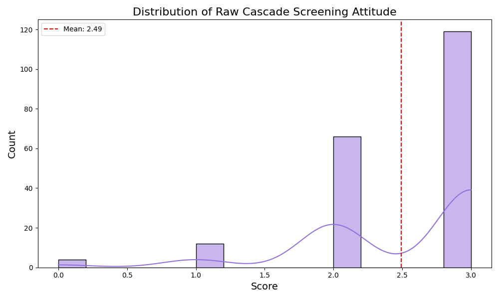
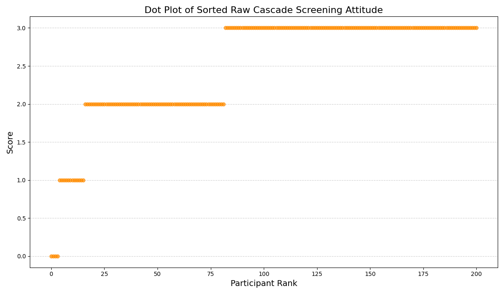
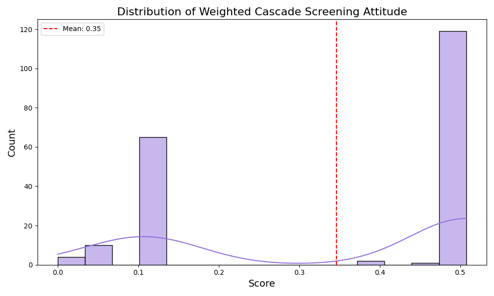
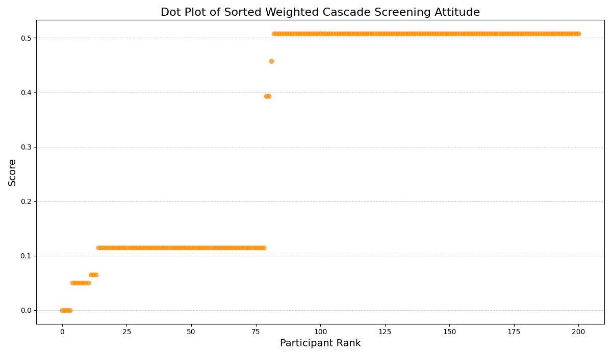

# Detailed Analysis: Cascade Screening Attitudes

This document provides an in-depth breakdown of the participant scores regarding Cascade Screening attitudes (the importance of screening family members), comparing both the Raw (1 point per positive answer) and Weighted (1-p inverse difficulty) methodologies.

## Part 1: Raw Scoring Analysis (Max Score = 3.0)

### Chart 1: Raw Cascade Screening Attitude Distribution

**Detailed Description:**
- **Axes Interpretation:** The X-axis represents the raw integer score (0 to 3), tallying positive attitudes regarding family/cascade screening. The Y-axis represents the number of participants.
- **Distribution Shape:** Similar to partner selection, this distribution is heavily skewed toward the positive end (scores 2.0 and 3.0). 
- **Analytical Insight:** The vast majority of the cohort understands and agrees with the theoretical importance of cascade screening. A score of 0 is an extreme outlier here. 
- **Key Difference:** However, there is a slightly wider spread here than in partner selection, meaning participants were marginally more hesitant or divided on cascade screening (likely due to the perceived difficulty of convincing relatives, as asked in Q39).

### Chart 2: Raw Cascade Screening Attitude Dot Plot

**Detailed Description:**
- **Visual Features:** The plot reveals three distinct horizontal steps/plateaus corresponding to scores of 1.0, 2.0, and 3.0.
- **Analytical Insight:** The massive plateau at 2.0 and 3.0 indicates that participants naturally cluster into "moderate agreement" and "full agreement" tiers. Very few exist in the "disagreement" tier (score 0-1).
- **Conclusion:** While raw scoring easily categorizes people into strict integer bins, it treats all questions equally, masking the psychological differences between simply acknowledging importance vs. actually finding it easy to convince relatives.

---

## Part 2: Weighted Scoring Analysis (Inverse Difficulty $1-p$)

### Chart 3: Weighted Cascade Screening Attitude Distribution

**Detailed Description:**
- **Axes Interpretation:** The X-axis represents the newly calculated weighted decimal scores. 
- **Visual Shift:** Unlike the raw distribution, the weighted distribution begins to spread out, displaying distinct, separated peaks (a multimodal distribution).
- **Analytical Insight:** This is a crucial chart. Because Q39 ("How easy is it to convince relatives") had a much lower positive response rate ($p$) compared to Q35 ("Is it important"), the $1-p$ weight for Q39 is much higher. Participants who answered Q39 positively were heavily rewarded. This breaks the raw "ceiling effect" and mathematically separates the participants who hold "rare/strong" positive attitudes from those who hold "common/weak" positive attitudes.

### Chart 4: Weighted Cascade Screening Attitude Dot Plot

**Detailed Description:**
- **Visual Features:** Look at the shape of the curve compared to the raw dot plot. The rigid horizontal integer steps are gone. Instead, we see a much smoother, steeper curve with smaller, tighter sub-clusters.
- **Analytical Insight:** The vertical jumps between dots are highly revealing. A steep vertical jump indicates that a participant possesses a statistically "difficult" positive attitude (like finding family convincing easy) that pushes them into a higher elite tier. 
- **Conclusion:** For cascade screening, the weighted (1-p) scoring method provides a vastly superior metric for statistical analysis. It successfully maps a 3-question survey into a dynamic, continuous spectrum of attitude strength.
