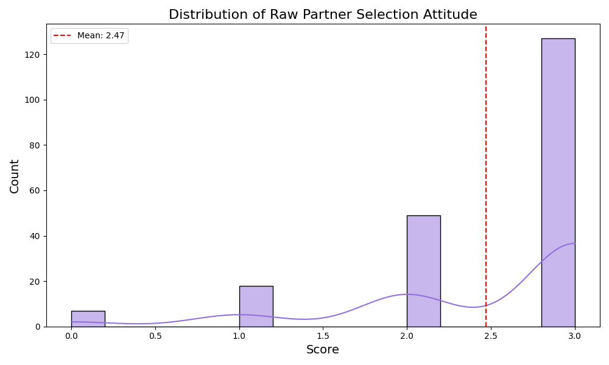
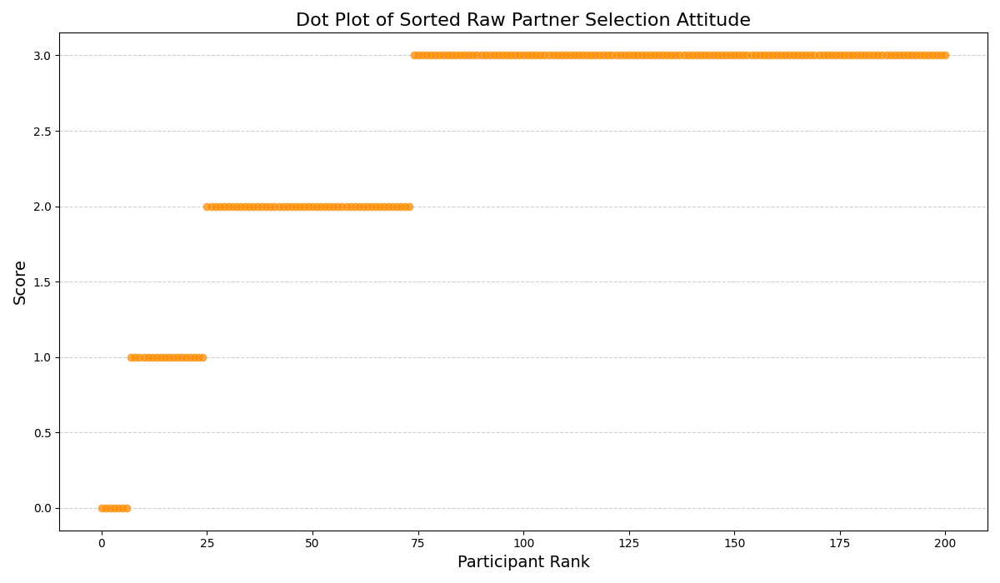
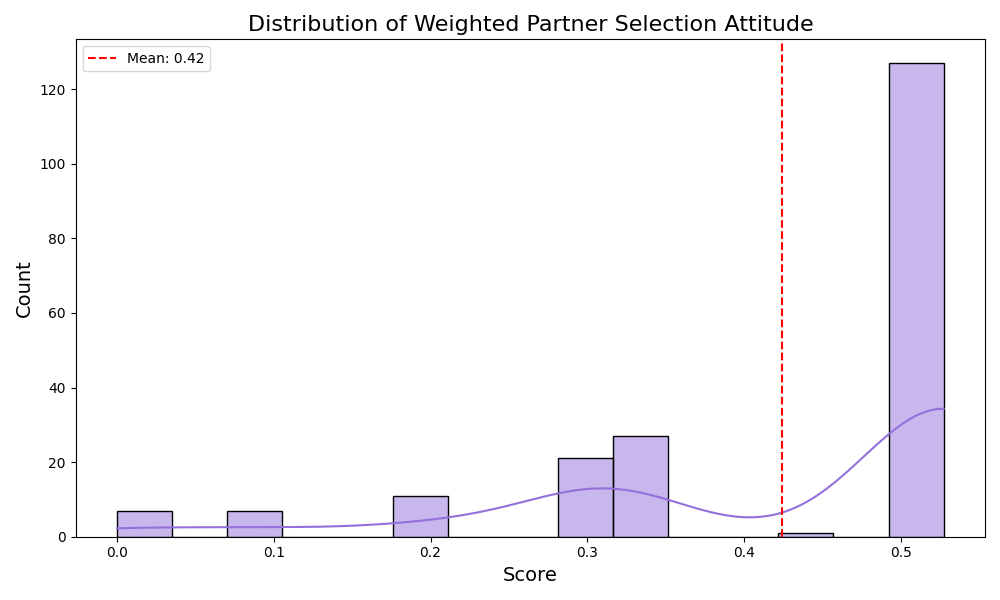
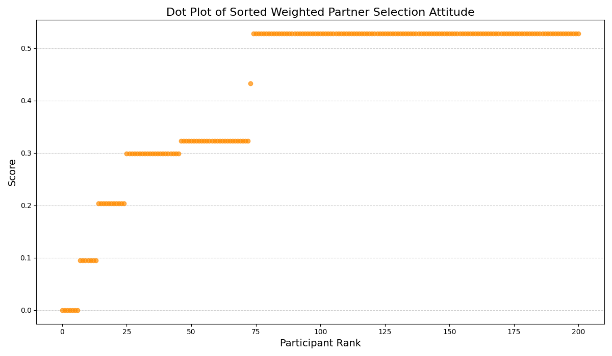

# Detailed Analysis: Partner Selection Attitudes

This document provides an in-depth breakdown of the participant scores regarding Partner Selection attitudes, comparing both the Raw (1 point per positive answer) and Weighted (1-p inverse difficulty) methodologies.

## Part 1: Raw Scoring Analysis (Max Score = 3.0)

### Chart 1: Raw Partner Selection Attitude Distribution

**Detailed Description:**
- **Axes Interpretation:** The X-axis represents the raw integer score (0, 1, 2, or 3), counting how many positive attitudes a participant holds regarding partner selection. The Y-axis represents the frequency (number of participants).
- **Distribution Shape:** The histogram displays a massive left-skew (negative skew). The bulk of the density is concentrated on the far right (scores of 2 and 3). 
- **Analytical Insight:** This indicates that almost the entire cohort inherently possesses very positive attitudes towards partner selection (e.g., they overwhelmingly agree that carrier screening is important and they reject consanguineous marriages). Very few participants scored a 0 or 1.
- **Statistical Implications:** Because so many participants share the exact same high score, the raw scoring method creates a "ceiling effect," making it difficult to differentiate between participants during advanced statistical analyses (like t-tests or correlations).

### Chart 2: Raw Partner Selection Attitude Dot Plot

**Detailed Description:**
- **Axes Interpretation:** The X-axis ranks the 201 participants from the lowest attitude score to the highest. The Y-axis plots their raw score.
- **Visual Features:** Rather than a smooth curve, this plot is composed of rigid, horizontal "steps." 
- **Analytical Insight:** The massive flat plateau at the top right visually confirms the ceiling effect mentioned above. Over 100 participants occupy the exact same horizontal line at score 2.0 and 3.0. 
- **Conclusion:** While it is highly encouraging from a public health perspective that most people have positive attitudes, this raw scoring method lacks the granularity needed to identify subtle nuances in participant sentiment.

---

## Part 2: Weighted Scoring Analysis (Inverse Difficulty $1-p$)

### Chart 3: Weighted Partner Selection Attitude Distribution

**Detailed Description:**
- **Weighting Mechanism:** In this model, positive attitudes that are statistically rare are rewarded with a higher score ($1-p$). Because positive attitudes were extremely common in this category (often $p > 0.80$), the resulting $1-p$ weights are very small (e.g., 0.15, 0.20).
- **Axes Interpretation:** The X-axis represents the new continuous, weighted decimal score. The Y-axis is frequency.
- **Distribution Shape:** The distribution is visually squashed towards the left (closer to 0) because the maximum possible score has mathematically shrunk. However, the *relative* shape still strongly mirrors the raw data.
- **Analytical Insight:** Even with difficulty weighting, the underlying lack of variance dominates. Participants still clump together in massive bins.

### Chart 4: Weighted Partner Selection Attitude Dot Plot

**Detailed Description:**
- **Visual Features:** The rigid integer steps from the raw dot plot have been transformed into slightly sloped, decimal-based steps.
- **Analytical Insight:** Because there were only 3 questions in this category, there are a limited number of mathematical combinations a participant could achieve. The weighted scoring separated some ties (distinguishing between *which* specific positive attitudes a participant held), slightly softening the strict plateaus into smaller sub-clusters.
- **Conclusion:** Weighted scoring introduces slight granularity, but the overall conclusion remains: the cohort overwhelmingly shares positive, homogeneous attitudes towards partner selection.
