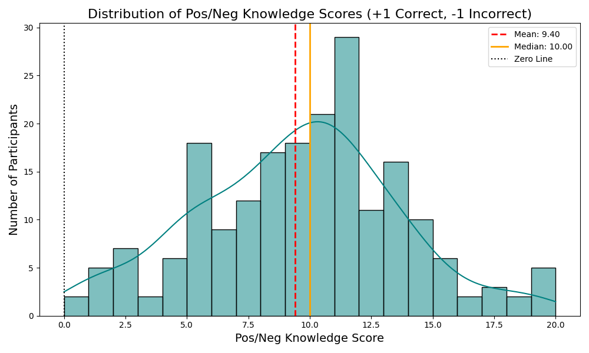

# Detailed Analysis: Positive/Negative Knowledge Score Distribution

In Phase 3, a strict penalty-based scoring system was introduced to account for guessing probability:
- **+1 Point:** Correct answer or correct multiple-choice option selected.
- **-1 Point:** Incorrect answer or incorrect multiple-choice option selected.
- **0 Points:** "I don't know" / "Not sure" / Blank responses.

### In-Depth Observations
- **Wider Spread & Variance:** Unlike the raw scoring method which compressed all participants into positive integers, the introduction of a -1 penalty causes the distribution to widen significantly. 
- **The Zero Line Boundary:** A crucial feature of this distribution is the zero line. Participants scoring near 0 indicate that their correct medical knowledge is entirely offset by dangerous misconceptions (or they consistently chose "I don't know"). 
- **Negative Outliers:** The distribution reveals a subset of participants extending into negative territory. These individuals hold active misconceptions regarding thalassemia (e.g., believing it is contagious or curable with common treatments), which from a public health perspective, is more dangerous than simply lacking knowledge.
