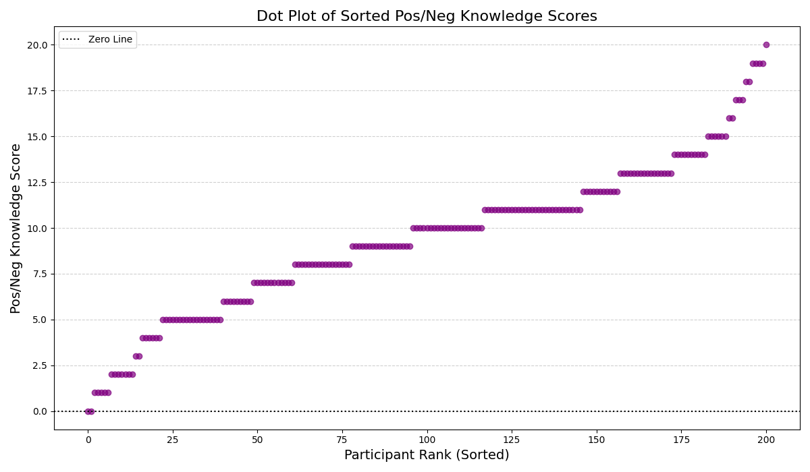

# Positive/Negative Scores Dot Plot

### Interpretation
- Sorting the scores visually demonstrates the sheer variance introduced by negative penalties. 
- You can visibly see the proportion of the cohort that fell below the zero line (meaning their misconceptions outweighed their actual knowledge).
