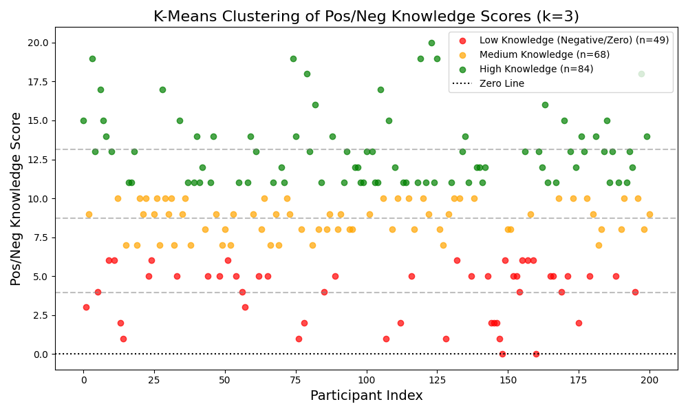

# K-Means Clustering on Pos/Neg Scores

### Cluster Assignments
With the negative penalties applied, the K-Means algorithm naturally separated participants who hold dangerous misconceptions from those who are highly knowledgeable:
- **Low Knowledge (Negative/Zero) [Red]:** Participants dominated by incorrect guesses or a lack of knowledge.
- **Medium Knowledge [Orange]:** Participants who know the basics and didn't guess incorrectly too often.
- **High Knowledge [Green]:** Participants with extensive medical knowledge and almost zero misconceptions.
