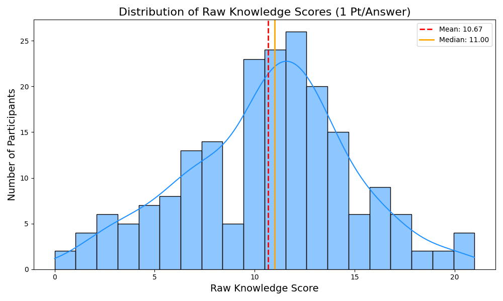

# Raw Knowledge Score Distribution (1 Point Per Correct Answer)

The histogram below displays the distribution of the raw knowledge scores across all 201 participants. In this scoring system, every correct single-choice answer and every correct multiple-choice option selected simply adds 1 point to the total score.

### Key Observations
- This plot reveals the unweighted distribution, allowing us to see exactly how many facts the average participant knew without difficulty weighting.
