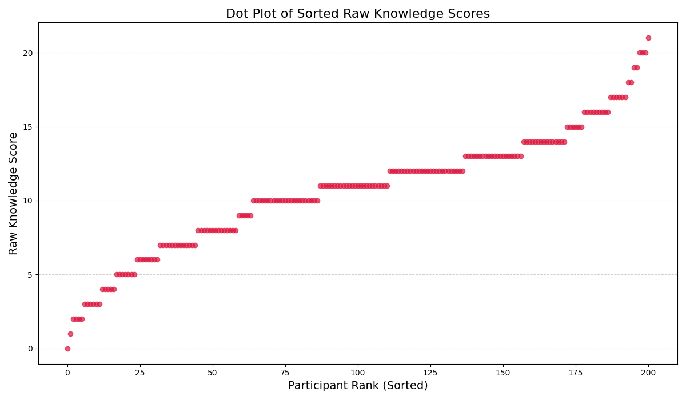

# Raw Knowledge Scores Dot Plot (Cluster Analysis)

The dot plot below visualizes the `Raw_Knowledge_Score` for all 201 participants, sorted from lowest to highest. 

### Interpretation Guide:
- By plotting the raw scores linearly, we can see if the previous plateaus and steep vertical jumps (outlier gaps) were a product of the difficulty weighting, or if they exist naturally in the sheer volume of facts known by participants.
