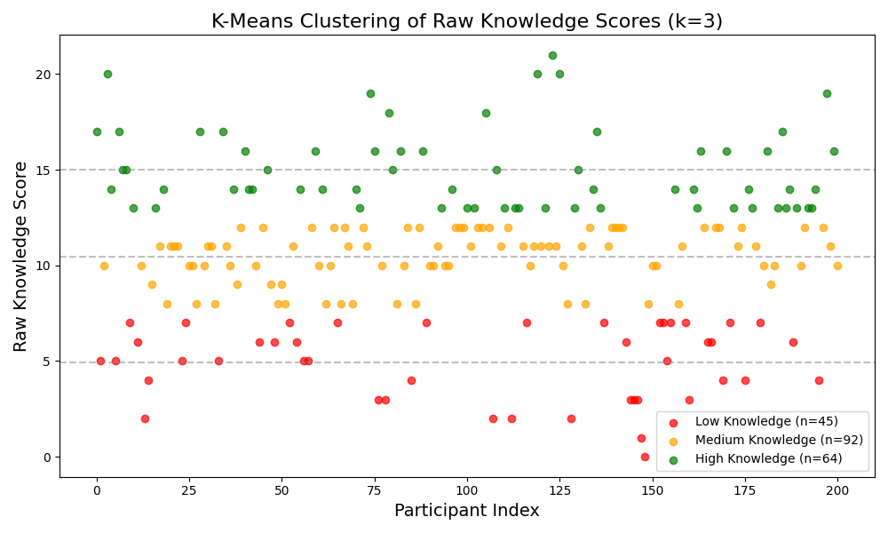

# K-Means Raw Score Clustering

A 1D K-Means clustering algorithm ($k=3$) was applied to the unweighted `Raw_Knowledge_Score`. 

### Cluster Assignments
This clustering identifies the Low, Medium, and High knowledge tiers based purely on the volume of correct answers provided, stripping away the inverse-difficulty weighting used previously.
- **Low Knowledge (Red)**
- **Medium Knowledge (Orange)**
- **High Knowledge (Green)**
